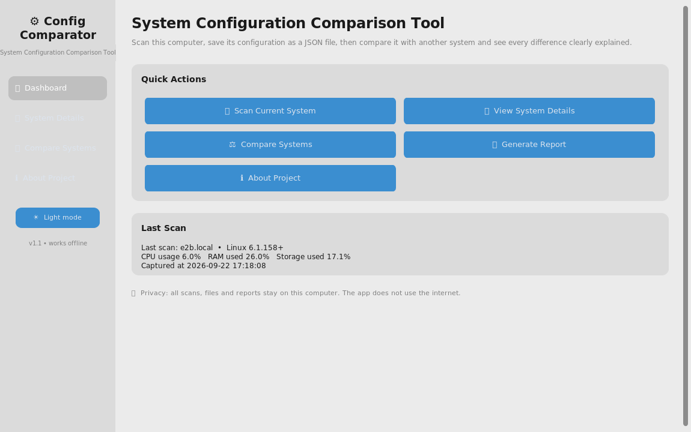
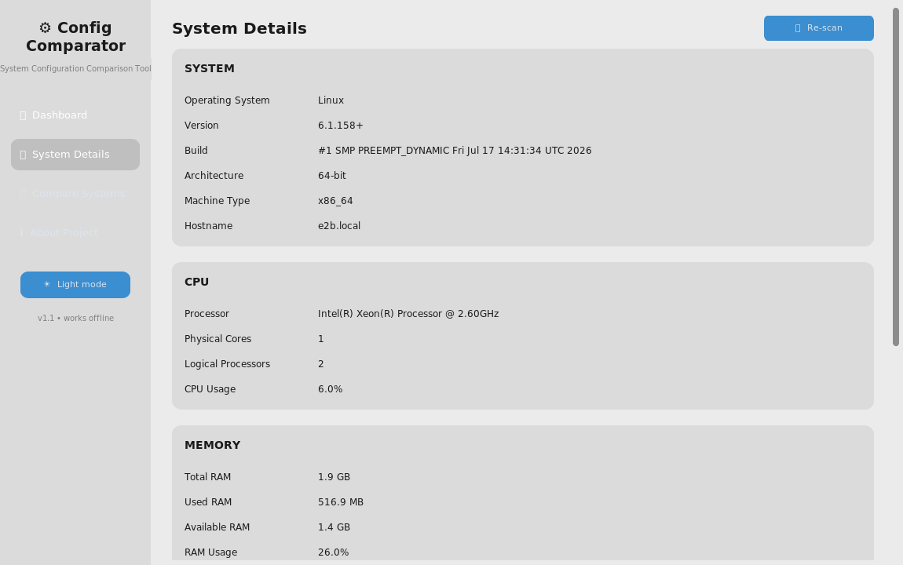
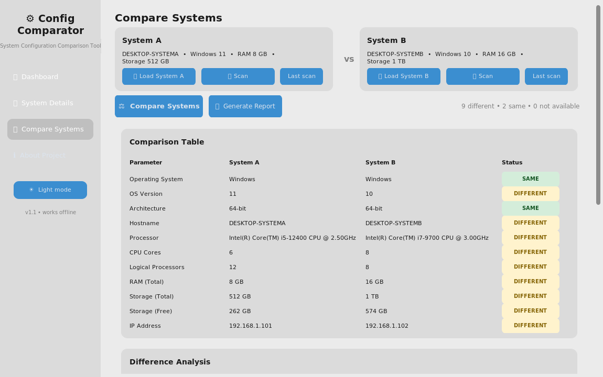

# System Configuration Comparison Tool

A Python-based GUI application that **retrieves the configuration of a computer**,
saves it as a portable JSON file, and **compares two configurations** while
clearly explaining every difference.

> **Project note:** This project was developed as an **academic project for
> LPU EDU-Revolution**, based on the project example listed on the LPU portal
> ("System Configuration Comparison Tool", shown under the Smart India
> Hackathon / GOV ETC example section, TRL 3 – Experimental Proof of Concept).
> It is **not** an official Smart India Hackathon entry, and the author has
> **no participation in SIH or any association with any government or external
> organization**. The SIH name is referenced only because LPU lists that entry
> as the project example.

---

## Introduction

System configuration (CPU, RAM, storage, operating system, …) changes over
time and differs from machine to machine. IT staff and students often need to
check quickly: *"What is different between these two computers?"* — for
example, before migrating software, troubleshooting a lab machine, or
documenting hardware for a record.

This tool makes that check a three-button exercise: **scan → save → compare**.
The result is a color-coded table plus plain-English difference statements
("System B has 8 GB more RAM than System A") and an exportable HTML report.

## Problem Statement

Comparing the configurations of two computers by hand (manual checks,
spec sheets, screenshots) is slow, error-prone and hard to explain. There is a
need for a simple, local, GUI-based tool that:

1. retrieves the system configuration automatically,
2. displays it in a readable way,
3. lets the user compare two configurations,
4. clearly highlights similarities and differences.

## Objective

Build a working Python GUI desktop application that retrieves and compares
system configuration, using only free, offline, standard/low-dependency
tools, so that a first-year student can use, understand and explain the whole
system.

## Features

| # | Feature | Description |
|---|---------|-------------|
| 1 | Dashboard | Modern sidebar UI with quick actions, last-scan summary and light/dark mode |
| 2 | Current System Scanner | Collects OS, CPU, RAM, storage, network details (psutil + platform) |
| 3 | System Details page | All detected values in organized cards with usage progress bars |
| 4 | Save configuration | Exports the current configuration as a structured JSON file |
| 5 | Load configuration | "Load System A" / "Load System B" open previously saved JSON files |
| 6 | Comparison table | Parameter-by-parameter table of System A vs System B |
| 7 | Difference analysis | Factual sentences, e.g. "System B has 512 GB more total storage than System A." |
| 8 | Comparison summary | Auto-generated ✓ / ✗ list with a total difference count |
| 9 | Visualization | Simple text-bar charts for RAM and storage |
| 10 | Report generation | Self-contained HTML report (openable in any browser, printable to PDF) |
| 11 | About page | Project purpose, technology stack and privacy statement |

**Graceful degradation:** if any hardware detail cannot be read (e.g. CPU name
on an unusual platform), the app shows "Not available" and marks that row as
MISSING in a comparison — it never crashes.

## Technology Used

| Component | Technology | Why |
|-----------|-----------|-----|
| Language | Python 3 | Simple, readable, great system tools |
| GUI | CustomTkinter (Tkinter) | Modern-looking desktop GUI with built-in dark mode, no extra setup |
| System info | `psutil` | Cross-platform CPU / RAM / disk / process statistics |
| OS info | `platform` (stdlib) | OS name, version, architecture, machine type |
| Networking | `socket` (stdlib) | Hostname and local IP (works offline) |
| Data format | `json` (stdlib) | Human-readable, portable configuration files |
| Report | Plain HTML (stdlib `html`) | No extra libraries; opens anywhere, prints to PDF |

**No database, no internet, no cloud, no Docker, no paid/AI APIs.** After
`pip install`, the app works fully offline.

### Production-level features (v1.1)

* **Responsive UI** — the system scan runs in a background worker thread, so
  the window never freezes even while the OS is queried (the UI thread is the
  only thread that touches widgets).
* **Application logging** — every scan, save, load, comparison and report is
  logged to the console and to `logs/app.log` with timestamps.
* **Global error handling** — an uncaught-exception hook logs the full
  traceback to `logs/app.log` and shows a dialog; the application keeps
  running instead of crashing.
* **Graceful startup** — missing dependencies produce a clear
  "pip install -r requirements.txt" message instead of a raw traceback.
* **Packaging** — `pyproject.toml` (the project is an installable Python
  package with a console script), MIT `LICENSE`, `CHANGELOG.md`.
* **One-click launchers** — `start.bat` (Windows) and `run.sh` (Linux/macOS)
  create a virtual environment, install dependencies and launch the app
  automatically on first run.

## System Architecture

Three-layer design — each layer can be tested on its own:

```
┌────────────────────────────────────────────────────────────┐
│  PRESENTATION   app/gui.py                                 │
│  CustomTkinter: dashboard, details, compare, about pages   │
└──────────────┬─────────────────────────────────────────────┘
               │ calls
┌──────────────▼─────────────────────────────────────────────┐
│  LOGIC            app/comparison.py   app/report.py        │
│  compare_configs()  summarize()  build_html()              │
└──────────────┬─────────────────────────────────────────────┘
               │ reads / writes
┌──────────────▼─────────────────────────────────────────────┐
│  DATA             app/system_info.py   app/storage.py      │
│  psutil + platform scan      JSON save / load / validate   │
└────────────────────────────────────────────────────────────┘
```

**Project structure**

```
system-config-comparison/
├── main.py                  # entry point (python main.py)
├── start.bat                # Windows one-click launcher (auto-setup)
├── run.sh                   # Linux/macOS one-click launcher (auto-setup)
├── requirements.txt
├── pyproject.toml           # packaging metadata
├── LICENSE                  # MIT
├── CHANGELOG.md
├── README.md
├── VIVA_QUESTIONS.md
├── logs/                    # app.log (created at runtime)
├── app/
│   ├── __init__.py
│   ├── gui.py               # CustomTkinter UI (sidebar + 4 pages)
│   ├── system_info.py       # retrieves the system configuration
│   ├── comparison.py        # comparison + difference analysis + summary
│   ├── storage.py           # JSON save / load / validation
│   ├── report.py            # HTML report builder
│   └── utils.py             # formatting helpers (bytes→GB, bars, …)
├── data/sample/
│   ├── system_a.json        # demonstration configuration A (laptop, 8 GB)
│   └── system_b.json        # demonstration configuration B (workstation, 16 GB)
├── reports/
│   └── example_report.html  # sample generated report
├── screenshots/             # real screenshots of the running app
└── tests/
    ├── test_comparison.py   # 7 unit tests for the comparison logic
    ├── test_core.py         # tests: scan, save/load, invalid file, report
    └── test_gui_smoke.py    # GUI smoke test (exercises every feature)
```

## Installation

### Option 1 — one click (easiest)

Requires **Python 3.9+** on the PATH (on Windows the official python.org
installer includes Tkinter automatically).

* **Windows:** double-click `start.bat`
* **Linux / macOS:** `./run.sh`

The first run creates a `.venv` virtual environment and installs the two
dependencies automatically; every later run just starts the app.

### Option 2 — manual

```bash
# 1. get the code
git clone <your-repo-url>
cd system-config-comparison

# 2. (recommended) create a virtual environment
python -m venv .venv
.venv\Scripts\activate        # Windows
# source .venv/bin/activate   # Linux/macOS

# 3. install dependencies (only two packages)
pip install -r requirements.txt

# 4. run
python main.py
```

`requirements.txt`:

```
psutil>=5.9
customtkinter>=5.2
```

On Linux, if tkinter is missing: `sudo apt install python3-tk`.

## How to Run

```bash
python main.py
```

## How It Works

1. **Scan** — `system_info.get_system_config()` asks `psutil` for CPU, RAM and
   disk statistics, `platform`/`socket` for OS and network details, and (on
   Windows) PowerShell for the CPU model name. Every field is protected, so a
   missing value becomes `None` → displayed as "Not available".
2. **Save** — the dict is written as indented JSON (`storage.save_config`),
   e.g. `system_a.json`. Byte counts are stored as numbers so differences can
   be computed exactly.
3. **Load** — `storage.load_config` reads a JSON file and validates that it
   really looks like a configuration; bad files produce a friendly error
   dialog instead of a crash.
4. **Compare** — `comparison.compare_configs` walks a fixed list of parameters
   (OS, version, architecture, hostname, processor, cores, logical processors,
   RAM, storage total/free, IP). Each row becomes SAME, DIFFERENT or MISSING,
   with a factual note (byte/number deltas are computed, e.g. "8 GB more RAM").
5. **Summarize** — `comparison.summarize` turns the rows into ✓/✗ lines and a
   total difference count.
6. **Report** — `report.generate_html_report` renders systems, table,
   differences and summary into one self-contained HTML file.

**Threading model:** scanning is the only time-consuming operation. It runs in
a daemon worker thread which never touches Tcl/Tk — it only puts its result
into a thread-safe `queue.Queue`. The UI thread polls that queue every
100 ms (via `after`) and applies the result there. The single rule "only the
UI thread touches widgets" is what keeps the GUI stable on every platform.

### How to use the app (demo script)

1. On the **Dashboard**, click **🔍 Scan Current System**.
2. Click **📋 View System Details** to see the machine in cards.
3. Go to **📊 Compare Systems**:
   * System A → **Last scan** (or **Scan**),
   * System B → **📂 Load System B** and pick a JSON file
     (use `data/sample/system_b.json` for a quick demo),
4. Press **⚖ Compare Systems** — the table, difference analysis, summary and
   bar charts appear.
5. Press **📄 Generate Report** and save the HTML report.

## Screenshots

Real screenshots of the running application:

| Dashboard (after a live scan) | System Details | Comparison result |
|---|---|---|
|  |  |  |

A sample generated report is included: [reports/example_report.html](reports/example_report.html)

## Testing

All tests use plain `python` (no pytest needed):

```bash
python tests/test_comparison.py    # 7 comparison-logic unit tests
python tests/test_core.py          # scan / storage / report tests
python tests/test_gui_smoke.py     # full GUI smoke test (needs a display)
```

Covered cases:

* identical configurations → 0 differences
* different RAM → "System B has 8 GB more RAM than System A."
* different storage → "System B has 512 GB more total storage than System A."
* different CPU → "The processors are different."
* different operating systems → "The operating systems are different."
* missing value (empty string / `None` / absent key) → MISSING, no crash
* completely empty configuration → no crash, all rows MISSING
* invalid JSON file → clear error, no crash
* save/load round-trip and HTML report content checks
* GUI smoke test: every page, scan, save, load, compare, report — no crashes

## Future Scope

Proposed (not implemented) improvements:

* remote configuration comparison (fetch a snapshot over the network)
* local network discovery of nearby machines
* more hardware details (GPU, battery, BIOS, installed software)
* hardware compatibility checking for a target application
* performance benchmarking (CPU/memory/disk speed tests)
* historical tracking of a machine's configuration over time
* scheduled / automated report generation
* multi-system comparison (more than two systems)
* database storage instead of JSON files
* web-based version

## Project Limitations

* Compares **one system drive** and **total physical memory** — per-drive and
  per-stick detail is not collected (intentionally kept simple).
* CPU usage / RAM usage are point-in-time measurements; they differ between
  scans even on the same machine, so they are displayed but not counted as
  configuration differences.
* The CPU model name depends on the OS tool (PowerShell on Windows,
  `/proc/cpuinfo` on Linux); on very unusual systems it may be "Not available".
* The HTML report is single-page; there is no built-in PDF writer (browsers
  can print it to PDF).
* The tool makes factual statements only; it never judges which machine is
  "better".

## Security and Privacy

* The application **only reads** information about the computer it runs on.
* Configuration files and reports are **saved locally** as JSON/HTML.
* **No personal data is collected, no account is required, and nothing is
  ever sent to any external server** — the app uses no network calls except
  reading the machine's own IP address.
* It works fully offline after installation.

## Author

Developed by a **first-year B.Tech CSE student** (LPU) as an academic project
for **LPU EDU-Revolution**, based on the project example provided on the LPU
portal. Not affiliated with Smart India Hackathon or any government
organization.
